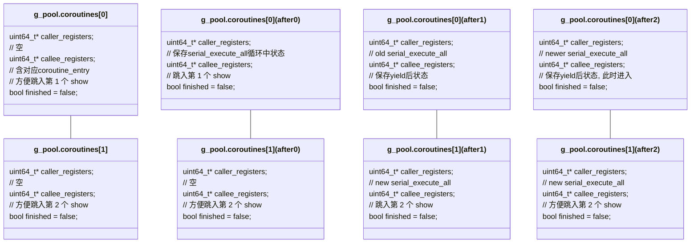
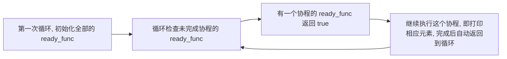

# Coroutine Report

## Task 1

### 代码展示

1. 协程启动部分: 
    ```c++
    void serial_execute_all() {
      // 以上为原本框架
      context_id = 0;
      int finish_count = 0; // 用于记录已完成的协程数
      while (finish_count < coroutines.size()) {
        if (coroutines[context_id]->finished) finish_count++; // 协程完成, 计数器加一
        else coroutines[context_id]->resume(); // 协程未完成, 恢复协程
        context_id = (context_id + 1) % coroutines.size(); // 轮转下标
      }
      // 以下为原本框架
    }
    ```

2. `context.S` 中的汇编代码: 
    ```asm
    .global coroutine_switch
    coroutine_switch:
        # 保存 callee-saved 寄存器到 %rdi 指向的上下文
        movq %rsp, 64(%rdi)
        movq %rbx, 72(%rdi)
        movq %rbp, 80(%rdi)
        movq %r12, 88(%rdi)
        movq %r13, 96(%rdi)
        movq %r14, 104(%rdi)
        movq %r15, 112(%rdi)
        # 保存的上下文中 rip 指向 ret 指令的地址（.coroutine_ret）
        # 这里需要先用 leaq 暂存到 %rax，再 movq
        # 因为 movq 没办法接受两个内存指向地址作为参数
        leaq .coroutine_ret(%rip), %rax
        movq %rax, 120(%rdi)
        # 从 %rsi 指向的上下文恢复 callee-saved 寄存器
        movq 64(%rsi), %rsp
        movq 72(%rsi), %rbx
        movq 80(%rsi), %rbp
        movq 88(%rsi), %r12
        movq 96(%rsi), %r13
        movq 104(%rsi), %r14
        movq 112(%rsi), %r15
        # 最后 jmpq 到上下文保存的 rip
        jmpq *120(%rsi)
    ```

### 栈的变化过程

`(after0)` 是首次执行 `resume()` 后, `(after1)` 是首次执行 `yield()` 后并到了下一个协程执行 `resume()` 后, `(after2)` 是第 2 个协程 `yield()` 后并且第 1 个协程再次 `resume()` 后



### 协程是如何运行的

首先从 `main()` 函数中初始化, 并调用 `serial_execute_all()` 启动执行. `g_pool` 中的所有协程都会有一个 `basic_context` 储存. 我们主要需要关注其中的 `caller_registers` 和 `callee_registers` 两个成员. `callee_registers` 一开始保存了 `coroutine_entry` , 这是为了方便第一次调用 `resume()` 时能直接开始运行协程函数.

而在 `serial_execute_all()` 中, 会不断轮转执行协程, 直到所有协程的 `finished` 标志位都被设置为 `true`. 然后会再执行最后一遍循环, 不断将计数器 `finish_count++` , 最后退出循环.

再来看循环中调用的 `resume()` 函数具体操作了什么. 

```c++
virtual void resume() {
  // 调用 coroutine_switch
  // 在汇编中保存 callee-saved 寄存器，设置协程函数栈帧，然后将 rip 恢复到协程 yield 之后所需要执行的指令地址。
  coroutine_switch(caller_registers, callee_registers);
}
```

`coroutine_switch()` 函数会将当前协程的上下文保存到 `caller_registers` 中, 然后将 `callee_registers` 中的上下文恢复到当前协程中, 最后跳转到 `callee_registers` 中保存的 `rip` 指向的地址, 第一次执行循环就会跳转到 `coroutine_entry()` , 进入 `coroutine_main()` , 启动协程函数.

接着看 `yield` 函数是如何跳回 `serial_execute_all()` 中的循环的. 

```c++
void yield() {
  if (!g_pool->is_parallel) {
    // 从 g_pool 中获取当前协程状态
    auto context = g_pool->coroutines[g_pool->context_id];
    // 调用 coroutine_switch 切换到 coroutine_pool 上下文
    coroutine_switch(context->callee_registers, context->caller_registers);
  }
}
```

可以看到这里就是简单的再次使用 `coroutine_switch()` 函数, 相当于将当前协程的上下文保存到 `callee_registers` 中, 然后恢复并跳到 `caller_registers` 中保存的 `rip` 指向的地址, 即 `serial_execute_all()` 中的循环. 这时候 `called_registers` 保存的上下文等到再次恢复的时候就会执行 `yield` 之后的指令.


## Task 2

### 代码展示

`sleep()` 的实现: 

```c++
void sleep(uint64_t ms) {
  if (g_pool->is_parallel) {
    // 已给框架部分
  } else {
    auto context = g_pool->coroutines[g_pool->context_id]; // 从 g_pool 中获取当前协程状态
    context->ready = false; // 将协程置为不可用状态
    // 获取当前时间，更新 ready_func
    auto current_time = get_time();
    context->ready_func = [current_time, ms]() -> bool { 
      // ready_func：检查当前时间，如果已经超时，则返回 true
      return std::chrono::duration_cast<std::chrono::milliseconds>(get_time() - current_time).count() >= ms;
    };
    // 调用 coroutine_switch 切换到 coroutine_pool 上下文
    yield();
  }
}
```

`serial_execute_all()` 改进:

```c++
void serial_execute_all() {
  // 以上为已给框架
  context_id = 0;
  int finish_count = 0;
  bool finished[coroutines.size()] = {0}; // 增加记录具体协程是否完成的记录数组
  while (finish_count < coroutines.size()) {
    if (coroutines[context_id]->finished) {
      // 如果是尚未标记, 则可以让计数器+1
      // 如果没有这个标记判断, 一个协程完成后, 剩下协程都遍历完一遍仍没有完成的
      // 循环会再次回到这里, 使得一个协程让计数器多次+1
      // 最终很可能只执行完一个协程, 而计数器已经达到了size, 退出循环
      if (!finished[context_id]) {
        finish_count++;
        finished[context_id] = true;
      }
    }
    else {
      if (coroutines[context_id]->ready) coroutines[context_id]->resume();
      else if (coroutines[context_id]->ready_func()) {
        coroutines[context_id]->ready = true;
        continue;
      }
    }
    context_id = (context_id + 1) % coroutines.size();
  }
  // 以下为已给框架
}
```

### 时间线

本质上还是所有协程函数串行执行, 不过将 `sleep()` 等待的时间用一个 `get_time()` 巧妙地变为了"同时"进行, 等待的时候还是处于 `serial_execute_all()` 的循环中 .



### 更高效的方法


## Task 3

### 代码展示

```c++
void lookup_coroutine(const uint32_t *table, size_t size, uint32_t value,
                      uint32_t *result) {
  size_t low = 0;
  while ((size / 2) > 0) {
    size_t half = size / 2;
    size_t probe = low + half;
    __builtin_prefetch(&table[probe]); // 预取中间二分附近的元素
    yield();
    uint32_t v = table[probe];
    if (v <= value) {
      low = probe;
    }
    size -= half;
  }
  *result = low;
}
```

### 性能提升

`log2_bytes=32`, `m=1024`, `b=1`: 
```text
naive: 591117.03 ns per search, 18472.41 ns per access
coroutine batched: 3342.25 ns per search, 104.45 ns per access
```

`log2_bytes=32`, `m=1024`, `b=64`: 
```text
naive: 551811.84 ns per search, 17244.12 ns per access
coroutine batched: 4789.85 ns per search, 149.68 ns per access
```