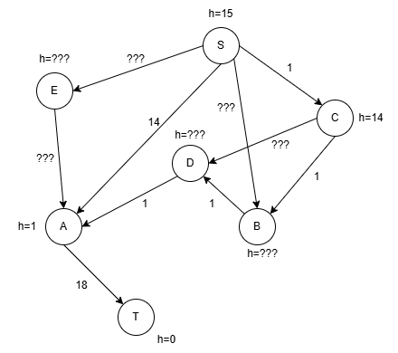

# 人工智能导论 2024 期末试题 回忆版

1. 经典 $\alpha$-$\beta$ 剪枝, 需要注意树不是齐的 (每个叶节点深度不一致)

2. inception 模块
   1. 计算 8 个 1\*1 的卷积核和 16 个 3\*3 的卷积核的输出通道数和形状
   2. 计算 8 个 1\*1 的卷积核和 16 个 3\*3 的卷积核的参数量
   3. 计算 5\*5 的通道的个数、步长和填充
```text
           拼接成 32 个通道
                  |
      ------------ -------------
      |                        |
16 个 3*3 的卷积核       ??? 个 5*5 的卷积核
步长为 1, 填充为 0       步长为 ???, 填充为 ???
      ^                        ^
      |                        |
8 个 1*1 的卷积核        x 个 1*1 的卷积核 (没记住到底是几个卷积核)
步长为 1, 填充为 0       步长为 1, 填充为 0
      ^                        ^
      |                        |
      ------------ -------------
                  |
          64 个 10*10 的通道
```

3. 负例是 $x_1=\left(\begin{matrix}0 & 0\end{matrix}\right)$ , 正例是 $x_2=\left(\begin{matrix}-1 & -1\end{matrix}\right)$ 和 $x_3=\left(\begin{matrix}1 & 1\end{matrix}\right)$ , 求 SVM 的参数, 并将 $x=\left(\begin{matrix}0.5 & 0\end{matrix}\right)$ 进行分类.

4. 用修正的A\*算法求解最短路径问题, 给出拓展节点顺序和解路径 (标 ??? 的是想不起来具体数了)



5. 分别用 ID3 和 C4.5 算法计算决策树第一步 (考试时会给出 $\log_2x$ 的值, 精确到小数点后 1 位)

|ID|特征A|特征B|类别|
|-|-|-|-|
|1|T|T|T|
|2|T|T|T|
|3|T|F|T|
|4|F|T|T|
|5|T|T|F|
|6|F|T|F|
|7|F|T|F|
|8|F|T|F|

6. 用神经网络的办法可以直接从训练数据集中学习出 SVM 中使用的核函数, 数据集 $\{(x_i,y_i)\}$ , 其中 $x\in\mathbb{R}^d$ , $y_i\in\{-1,1\}$ .
   1. 请你使用全连接神经网络设计, 画图+文字说明, 注意要写清输入输出的维度, 以及隐藏层维度
   2. 写清学习过程的伪代码 (参考 PPT 中 UCB 的伪代码), 并写清损失函数 (用数学描述和语言描述, 比如求 ... 对 ... 的偏导数)